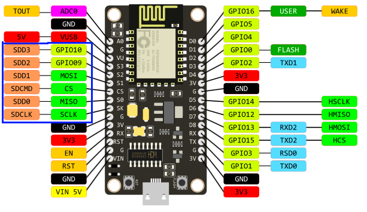

# The Node MCU ESP8266
The Node MCU ESP8266 is a low-cost Wi-Fi microcontroller with a full TCP/IP stack and a microcontroller unit (MCU) based on the Node MCU architecture. The Node MCU ESP8266 is a popular choice for IoT projects because of its low cost, ease of use, and built-in Wi-Fi capabilities. The Node MCU ESP8266 can be programmed using a variety of programming languages, including MicroPython, Lua, and Arduino C++. In this repository, we will be using MicroPython to program the Node MCU ESP8266.
## Pinout
The Node MCU ESP8266 has a total of 30 pins, which are divided into two rows of 15 pins each. The pins are labeled from D0 to D8, and from A0 to A0. The Node MCU ESP8266 also has a built-in LED on pin D0, which can be used for debugging purposes. The pinout of the Node MCU ESP8266 is shown below:

In use there will be different meanings for the pins, for example you name the pins different if you are using SPI or I2C devices. The pinout shown above is the default pinout for the Node MCU ESP8266. Oh, and by the way, the internal LED on pin D0 is active low, which means that you have to set the pin to LOW to turn the LED on, and HIGH to turn it off. Pin D0 is named GPIO16 in the MicroPython firmware, or simply 16.
## Using SPI and I2C devices
The Node MCU ESP8266 has built-in support for SPI and I2C devices, which makes it easy to connect external sensors and other devices to the Node MCU ESP8266. To use SPI and I2C devices with the Node MCU ESP8266, you will need to connect the devices to the appropriate pins on the Node MCU ESP8266, and then write code to communicate with the devices using the SPI or I2C protocol. The Node MCU ESP8266 has built-in support for the SPI and I2C protocols, which makes it easy to communicate with external devices using these protocols. The Node MCU ESP8266 also has built-in support for the OneWire protocol, which is commonly used to communicate with temperature sensors.
## Powering the Node MCU ESP8266
The Node MCU ESP8266 can be powered using a USB cable connected to a computer or a USB power adapter. The Node MCU ESP8266 has a built-in voltage regulator that can accept a wide range of input voltages, from 3.3V to 5V. The Node MCU ESP8266 can also be powered using a battery or a solar panel, as long as the voltage is within the acceptable range. The Node MCU ESP8266 has a built-in power LED that indicates when the Node MCU ESP8266 is powered on. The power LED is located next to the USB connector on the Node MCU ESP8266.
## Programming the Node MCU ESP8266
The Node MCU ESP8266 can be programmed using a variety of programming languages, including MicroPython, Lua, and Arduino C++. In this repository, we will be using MicroPython to program the Node MCU ESP8266. MicroPython is a lean and efficient implementation of Python 3 that includes a small subset of the Python standard library. MicroPython is well-suited for programming microcontrollers like the Node MCU ESP8266, because it is lightweight and easy to use. MicroPython also has built-in support for the ESP8266, which makes it easy to write code that interacts with the hardware features of the Node MCU ESP8266.
