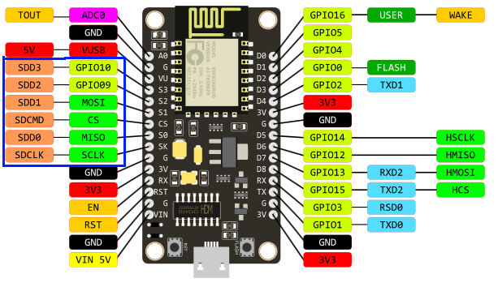

# About the NodeMCU ESP8266

The NodeMCU ESP8266 is a small Wi-Fi development board based on the ESP8266 chip. It is one of the most common boards for learning embedded systems and IoT because it is cheap, easy to program, and includes built-in Wi-Fi.

## Why it is useful

The ESP8266 is popular because it can:

- Run Python via MicroPython
- Connect to Wi-Fi
- Read inputs from buttons and sensors
- Control LEDs, relays, and other outputs
- Communicate with external devices over SPI, I2C, and other protocols

## Board layout and pins

A NodeMCU board has many GPIO pins, and the exact function of each pin depends on how the board is used. Some pins are general-purpose I/O, while others are used for flash memory, boot mode, or special interfaces.

The pinout image below shows the board layout:

## Important pin facts

A few things are important to remember when you work with the board:

- GPIO numbers are not the same as the printed D-number labels on some boards
- Some pins are used for boot-related functions and can behave differently at reset
- The board usually runs at 3.3V logic, not 5V
- You should check the datasheet or board documentation before connecting complex modules

## The built-in LED

Many NodeMCU boards have an onboard LED connected to GPIO2 or GPIO16 depending on the exact board version. On some boards it is active low, which means:

- LOW turns it ON
- HIGH turns it OFF

This is a common beginner confusion, so it is worth testing before assuming the behavior.

## Powering the board

The board can be powered in several ways:

- USB cable connected to a computer
- USB power adapter
- A regulated 3.3V power source for experiments

The USB connection is usually the easiest and safest way to start. Always double-check the voltage before connecting external modules.

## Programming the board

The ESP8266 can be programmed with several languages, including:

- MicroPython
- Lua
- Arduino C++

In this repository, we focus on MicroPython because it is simple to learn and well suited for beginners.

## Practical beginner advice

- Always verify pin numbers before writing code
- Be careful with pins that have special boot behavior
- Start with 3.3V-safe wiring
- Use a resistor when connecting an LED
- Test one component at a time

## Summary

The ESP8266 is an excellent learning board for embedded programming and IoT. It is small, affordable, and flexible, but it also has a few quirks that are important to understand when wiring circuits and writing code.

---

Next: [All about SPI](all_about_SPI.md).
